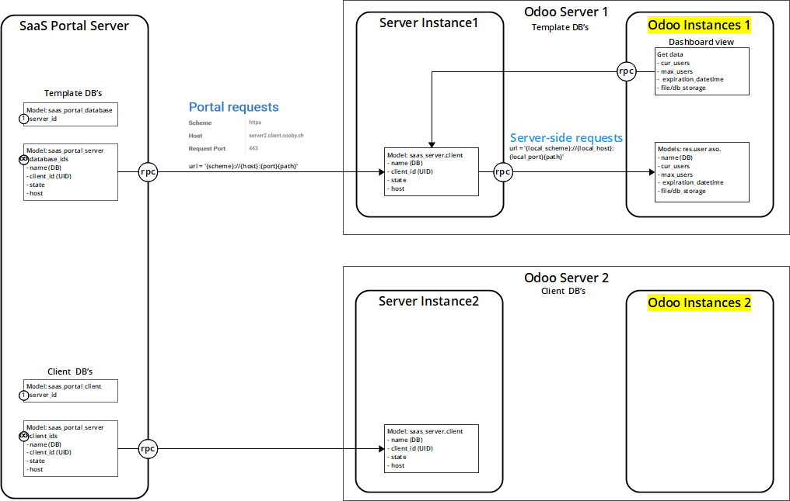

Development
===========

Structure of SaaS tools Server system:
--------------------------------------

* SaaS Portal instance - main instance for control servers and clients, manage client templates and plans.
* SaaS Servers - technical Odoo databases, running on same server instance or separate, to control client databases. SaaS server create, edit, delete databases. Each SaaS Server can be installed on a separate machine (e.g. VPS)
* SaaS Clients - client database to be used by customers. Each SaaS Client is attached to a SaaS Server.

Structure of SaaS models:
-------------------------

* **saas_portal.server_branch** - bundles the server into an abstraction of server ressources used by the plan
* **saas_portal.server** - represents the server databases, eg containers that are running a server db
* **saas_portal.server_parameter** - additional parameters which can be a added to the server model (only of informative character)
* **saas_portal.database** - represents the template databases, gets inherited by saas_portal.client
* **saas_portal.plan** - represents the subscription plan
* **saas_portal.client** - represents the client database

Portal/ Server / Client instance relations
__________________________________________

Entity Relations diagram simplified
___________________________________

.. image:: ../images/er_diagram_simplified_v2.1.png